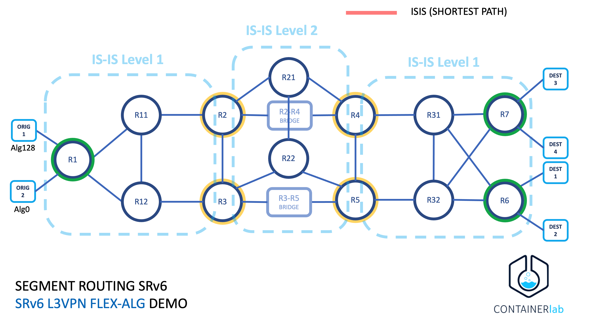
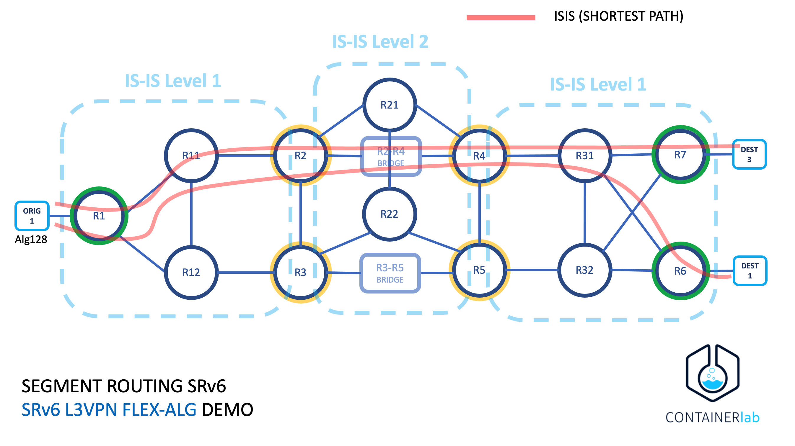
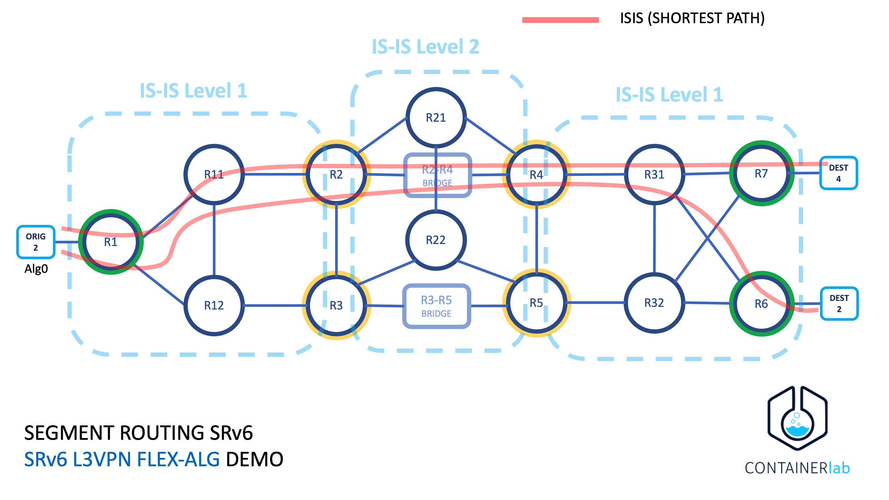
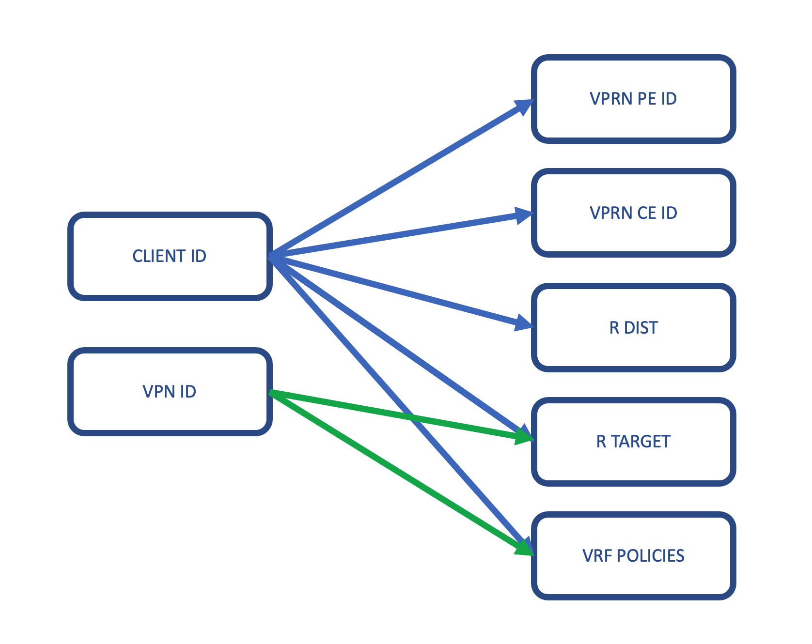
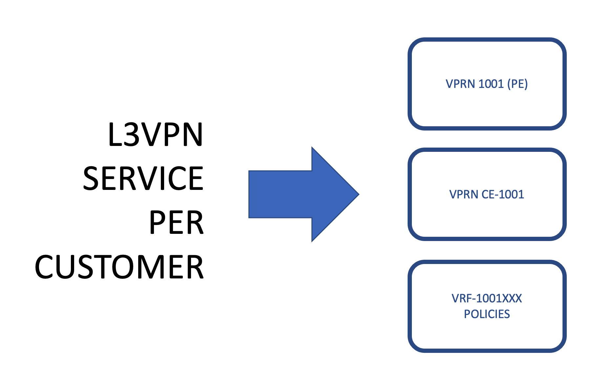

# Segment Routing Lab: SRv6 L3VPN Flexible Algorithms Demo


This lab is showing a simple configuration and verification of SRv6 on Nokia routers to signal both IGP’s shortest path and Algorithms with specific metric conditions (i.e. 10ms). All router network interfaces for transport are <b>using IPv6</b> and we are encpasulating IPv4 traffic.

Objective: Create a traffic-engineered path between R1 and R6 that uses delay as a metric.

Conditions:
* IGP Metrics: All IGP link metrics are 100
* Delay Metrics: All delay metrics are 10msec with the exception of the R3-R5 link, which is 15msec.
* We have created two different customer. Conditions of latency is only apply to one of them


## Network Setup

See topology on the next image:



Next images show the same with one option of the shortest path using ISIS.




## SRv6 with Flexible Algorithm
Segment Routing (SR) is applied to the IPv6 data plane using 128-bit SIDs and the SR routing header (SRH). The 128-bit SRv6 SID consists of a Locator, a Function, and an Argument.
* The Locator is encoded in the most significant bits of the SID. It is typically routable and leads to the node that instantiated the SID.
* The Function identifies a local endpoint behaviour, such as End, End.X, End.DT4 or End.DT2U.
The Locator is advertised into the IGP and is associated with an Algorithm. As a result, support for Flexible-Algorithm is inherited from day one, and a level of traffic engineering is possible without SRH overhead.
* Flex-Algo 128 SRv6 Locators: Alg128: 2001:db8:4502:n::/64 where n is Node-ID, so 1 is R1, 6 is R6 and 7 is R7

### Customer and VPN information
L3VPN info and prefixes can be found in customer.yml file in this repo
How we take care of the rest of the info like service-id and route target and route distinguisher, it's using the info from every customer. Check next pictures




## Requeriments
Versions used are:
* containerlab 0.25.1
* vr-sros 22.5.R2 (requires license)

SROS image was created using [VR Network Lab](https://github.com/vrnetlab/vrnetlab)
IMPORTANT: vr-sos must be set as an image in docker to be pull directly by containerlab
```
# docker images | grep vr-sros
vr-sros                               22.5.R2                         f33cd7a3732a        3 months ago        965MB
```

## Overview

If you are new with container lab, we recommed to check the post regading [Nokia SROS in the manual](https://containerlab.dev/manual/kinds/vr-sros/)

## Setting the lab

Create Bridges to use for delay testing and trigger Algorithm 128.

```
brctl addbr R2-R4
brctl addbr R3-R5
ip link set R2-R4 up
ip link set R3-R5 up
```

Use containerlab a specified topology
```
clab deploy --topo topo.yml
```
Checking elements in the lab
```
# clab inspect --topo topo.yml
```
Preping origin and destination containers:
```
./prep_clients.sh
```
Test connectivity (origin is 10.1.4.101 and destination is using 10.6.4.101)
```
# docker exec -ti clab-srv6-demo-origin1 ping 10.6.4.101
PING 10.6.4.101 (10.6.4.101): 56 data bytes
64 bytes from 10.6.4.101: seq=0 ttl=60 time=11.766 ms
64 bytes from 10.6.4.101: seq=1 ttl=60 time=8.953 ms
64 bytes from 10.6.4.101: seq=2 ttl=60 time=8.865 ms
64 bytes from 10.6.4.101: seq=3 ttl=60 time=8.695 ms
```

# Checking Router configurations

All router must be part of Algo128 to make it work
```
A:admin@R31# admin show configuration /configure router isis flexible-algorithms
    admin-state enable
    flex-algo 128 {
        participate true
        loopfree-alternate { }
        micro-loop-avoidance { }
    }

[/]
```

```
A:admin@R6# admin show configuration /configure routing-options
    flexible-algorithm-definitions {
        flex-algo "Flex-Algo-128" {
            admin-state enable
            description "Flex-Algo for Delay Metric"
            metric-type delay
        }
    }

[/]
A:admin@R6# admin show configuration /configure router isis flexible-algorithms
    admin-state enable
    flex-algo 128 {
        participate true
        advertise "Flex-Algo-128"
        loopfree-alternate { }
        micro-loop-avoidance { }
    }

[/]
```

Check ISIS database for validation:
```
A:admin@R31# show router isis database R31.00-00 level 1 detail | match "Router Cap" post-lines 10
  Router Cap : 192.0.2.31, D:0, S:0
    TE Node Cap : B E M  P
    SR Cap: IPv4 MPLS-IPv6
       SRGB Base:12000, Range:8000
    SR Alg: metric based SPF, 128
    Node MSD Cap: BMI : 12 ERLD : 15 SRH-MAX-SL : 10 SRH-MAX-END-POP : 9 SRH-MAX-H-ENCAPS : 1 SRH-MAX-END-D : 9
    SRv6 Cap: 0x0000
  I/F Addresses :
    I/F Address   : 192.0.2.31
    I/F Address   : 192.168.0.66
    I/F Address   : 192.168.0.73

[/]
```

```
A:admin@R6# show router isis database R6.00-00 level 1 detail | match "Router Cap" post-lines 12
  Router Cap : 192.0.2.6, D:0, S:0
    TE Node Cap : B E M  P
    SR Cap: IPv4 MPLS-IPv6
       SRGB Base:12000, Range:8000
    SR Alg: metric based SPF, 128
    Node MSD Cap: BMI : 12 ERLD : 15 SRH-MAX-SL : 10 SRH-MAX-END-POP : 9 SRH-MAX-H-ENCAPS : 1 SRH-MAX-END-D : 9
    SRv6 Cap: 0x0000
    FAD Sub-Tlv:
        Flex-Algorithm   : 128
        Metric-Type      : delay
        Calculation-Type : 0
        Priority         : 100
        Flags: M

[/]
```

## Dynamic link delay measurement and propagation
For simplification, all links have a static unidirectional link delay value of 10mSec (10000uSec), except the R3-R5 link which has a static delay of 15mSec (15000uSec). 
The exception is the link R2-R4, which uses dynamic link delay measurement using STAMP probes. Link delay is introduced using a virtual network emulator.


```
A:admin@R2# show test-oam link-measurement interface to_R4 detail

===============================================================================
Interface Link Measurement Information - to_R4
===============================================================================
Template Name: direct-link
Oper State               : Up
Protocol                 : IPv4
Oper Source Address      : 192.168.0.13
Source Auto-Assigned     : Yes
Oper Destination Address : 192.168.0.14
Destination Auto-Assigned: Yes
Failure Condition(s)     : None
Detectable Tx Error      : None

-------------------------------------------------------------------------------
Reporting
-------------------------------------------------------------------------------
Reporting Enabled          : Yes
Delay Measure Last Reported: 1136us
Timestamp                  : 2023/01/03 22:26:57
Triggered By               : SampleThresholdRelative

-------------------------------------------------------------------------------
Aggregate Sample Window Delay Measurement Detail       Currently Reporting: Avg
-------------------------------------------------------------------------------
End Timestamp (UTC)               State Count Min(us) Max(us) Avg(us) I  Result
-------------------------------------------------------------------------------
N/A                          InProgress     0       0       0       0 -       0
2023/01/03 22:26:57          SwReported     1       0       0       0 N       0
2023/01/03 22:26:47           Completed     1     856     856     856 Y     856
2023/01/03 22:26:37          SwReported     1       0       0       0 N       0
2023/01/03 22:26:27          SwReported     1       0       0       0 N       0
2023/01/03 22:26:17           Completed     1     879     879     879 Y     879
2023/01/03 22:26:07          SwReported     1       0       0       0 N       0
2023/01/03 22:25:57          SwReported     1       0       0       0 N       0
2023/01/03 22:25:47           Completed     1     853     853     853 Y     853
2023/01/03 22:25:37          SwReported     1       0       0       0 N       0
2023/01/03 22:25:27          SwReported     1       0       0       0 N       0
2023/01/03 22:25:17          SwReported     1       0       0       0 N       0
2023/01/03 22:25:07           Completed     1     841     841     841 Y     841
2023/01/03 22:24:57           Completed     1     811     811     811 Y     811
2023/01/03 22:24:47           Completed     1     866     866     866 Y     866
2023/01/03 22:24:37           Completed     1     870     870     870 Y     870
2023/01/03 22:24:27           Completed     1     850     850     850 Y     850
2023/01/03 22:24:17           Completed     1     949     949     949 Y     949
2023/01/03 22:24:07           Completed     1     834     834     834 Y     834
2023/01/03 22:23:57          SwReported     1       0       0       0 N       0

-------------------------------------------------------------------------------
Sample Window Delay Measurement Detail                 Currently Reporting: Avg
-------------------------------------------------------------------------------
End Timestamp (UTC)       State  Rcv/Snt  Min(us) Max(us) Avg(us) Err I  Result
-------------------------------------------------------------------------------
N/A                  InProgress    3/3          0       0       0   0 -       0
2023/01/03 22:26:57  SwReported    5/5        767    2417    1136   0 Y    1136
2023/01/03 22:26:47   Completed    5/5        758    1041     856   0 Y     856
2023/01/03 22:26:37  SwReported    5/5        700     960     856   0 Y     856
2023/01/03 22:26:27  SwReported    5/5        801    1496     987   0 Y     987
2023/01/03 22:26:17   Completed    5/5        746     972     879   0 Y     879
2023/01/03 22:26:07  SwReported    5/5        779     938     828   0 Y     828
2023/01/03 22:25:57  SwReported    5/5        808    1719    1055   0 Y    1055
```


These static/dynamic values are advertised into IS-IS.

```
A:admin@R2# show router isis database R2.00-00 level 2 detail | match "Nbr   : R4.00" post-lines 28
    Nbr   : R4.00
    Default Metric  : 100
    Sub TLV Len     : 137
    IF Addr   : 192.168.0.13
    Nbr IP    : 192.168.0.14
    TE APP LINK ATTR    :
      SABML-flag:Non-Legacy SABM-flags:R S
        MaxLink BW: 10000000 kbps
        TE Metric : 20
    TE APP LINK ATTR    :
      SABML-flag:Non-Legacy SABM-flags:R
        Resvble BW: 10000000 kbps
        Unresvd BW:
            BW[0] : 10000000 kbps
            BW[1] : 10000000 kbps
            BW[2] : 10000000 kbps
            BW[3] : 10000000 kbps
            BW[4] : 10000000 kbps
            BW[5] : 10000000 kbps
            BW[6] : 10000000 kbps
            BW[7] : 10000000 kbps
    TE APP LINK ATTR    :
      SABML-flag:Non-Legacy SABM-flags:   X
        Admin Grp : 0x400
        Delay Min : 858 Max : 858
        TE Metric : 20
    Adj-SID: Flags:v4BVLP Weight:0 Label:20204
    Adj-SID: Flags:v6BVL Weight:0 Label:524285
    End.X-SID: 2001:db8:4501:2:0:4000:: flags:B algo:0 weight:0 endpoint:End.X-USP
```

## Verifying SRv6-ISIS tunnel

Check the route-table for tunnels
```
A:admin@R1# show router route-table ipv6 2001:db8:4502:6::/64

===============================================================================
IPv6 Route Table (Router: Base)
===============================================================================
Dest Prefix[Flags]                            Type    Proto     Age        Pref
      Next Hop[Interface Name]                                    Metric
-------------------------------------------------------------------------------
2001:db8:4502:6::/64                          Remote  ISIS      00h00m02s  15
       2001:db8:4502:6::/64 (tunneled:SRV6-ISIS)                    40818
-------------------------------------------------------------------------------
No. of Routes: 1
Flags: n = Number of times nexthop is repeated
       B = BGP backup route available
       L = LFA nexthop available
       S = Sticky ECMP requested
===============================================================================

[/]
A:admin@R1# show router route-table ipv6 2001:db8:4502:7::/64

===============================================================================
IPv6 Route Table (Router: Base)
===============================================================================
Dest Prefix[Flags]                            Type    Proto     Age        Pref
      Next Hop[Interface Name]                                    Metric
-------------------------------------------------------------------------------
2001:db8:4502:7::/64                          Remote  ISIS      00h00m07s  15
       2001:db8:4502:7::/64 (tunneled:SRV6-ISIS)                    40818
-------------------------------------------------------------------------------
No. of Routes: 1
Flags: n = Number of times nexthop is repeated
       B = BGP backup route available
       L = LFA nexthop available
       S = Sticky ECMP requested
===============================================================================

[/]
```

```
A:admin@R1# show router tunnel-table ipv6 2001:db8:4502:7::/64

===============================================================================
IPv6 Tunnel Table (Router: Base)
===============================================================================
Destination                                     Owner     Encap TunnelId  Pref
Nexthop                                         Color           Metric
-------------------------------------------------------------------------------
2001:db8:4502:7::/64 [L]                        srv6-isis SRV6  524304    0
  fe80::5054:ff:fe1c:9300-"to_R11"                                40795
-------------------------------------------------------------------------------
Flags: B = BGP or MPLS backup hop available
       L = Loop-Free Alternate (LFA) hop available
       E = Inactive best-external BGP route
       k = RIB-API or Forwarding Policy backup hop
===============================================================================

[/]
A:admin@R1# show router tunnel-table ipv6 2001:db8:4502:6::/64

===============================================================================
IPv6 Tunnel Table (Router: Base)
===============================================================================
Destination                                     Owner     Encap TunnelId  Pref
Nexthop                                         Color           Metric
-------------------------------------------------------------------------------
2001:db8:4502:6::/64 [L]                        srv6-isis SRV6  524303    0
  fe80::5054:ff:fe1c:9300-"to_R11"                                40795
-------------------------------------------------------------------------------
Flags: B = BGP or MPLS backup hop available
       L = Loop-Free Alternate (LFA) hop available
       E = Inactive best-external BGP route
       k = RIB-API or Forwarding Policy backup hop
===============================================================================

[/]
```

```
A:admin@R1# traceroute 2001:db8:4502:6:: source-address 2001:db8:4502:1::
traceroute to 2001:db8:4502:6:: from 2001:db8:4502:1::, 30 hops max, 60 byte packets
  1  2001:db8:33ad::2 (2001:db8:33ad::2)    3.86 ms  1.73 ms  1.73 ms
  2  2001:db8:33ad::12 (2001:db8:33ad::12)    3.72 ms  2.70 ms  2.39 ms
  3  2001:db8:33ad::e (2001:db8:33ad::e)    4.60 ms  5.17 ms  3.48 ms
  4  2001:db8:33ad::42 (2001:db8:33ad::42)    6.17 ms  5.42 ms  4.65 ms
  5  2001:db8:33ad::4d (2001:db8:33ad::4d)    6.16 ms  6.99 ms  6.38 ms
[/]
A:admin@R1# traceroute 2001:db8:4502:7:: source-address 2001:db8:4502:1::
traceroute to 2001:db8:4502:7:: from 2001:db8:4502:1::, 30 hops max, 60 byte packets
  1  2001:db8:33ad::2 (2001:db8:33ad::2)    2.34 ms  1.71 ms  1.49 ms
  2  2001:db8:33ad::12 (2001:db8:33ad::12)    2.86 ms  2.76 ms  2.88 ms
  3  2001:db8:33ad::e (2001:db8:33ad::e)    3.88 ms  3.58 ms  3.66 ms
  4  2001:db8:33ad::42 (2001:db8:33ad::42)    5.18 ms  5.48 ms  4.68 ms
  5  2001:db8:33ad::5e (2001:db8:33ad::5e)    6.86 ms  5.85 ms  8.93 ms
[/]
```
```
A:admin@R1# show router isis database R1.00-00 level 1 detail | match "SRv6 Locator" post-lines 10
  SRv6 Locator  :
    MT ID : 0
    Metric: ( ) 1 Algo:0
    Prefix   : 2001:db8:4501:1::/64
    Sub TLV   :
      AttrFlags: N
      End-SID   : 2001:db8:4501:1:0:1000::, flags:0x0, endpoint:End-USP
    Metric: ( ) 1 Algo:128
    Prefix   : 2001:db8:4502:1::/64
    Sub TLV   :
      AttrFlags: N

[/]
```

## Adding delay to R2-R4

```
# brctl show
bridge name	bridge id		STP enabled	interfaces
R2-R4		8000.7645097640f5	no		eth3
							eth4
# tc qdisc add dev eth3 root netem delay 40ms
```

```
A:admin@R2# show test-oam link-measurement interface to_R4 detail

===============================================================================
Interface Link Measurement Information - to_R4
===============================================================================
Template Name: direct-link
Oper State               : Up
Protocol                 : IPv4
Oper Source Address      : 192.168.0.13
Source Auto-Assigned     : Yes
Oper Destination Address : 192.168.0.14
Destination Auto-Assigned: Yes
Failure Condition(s)     : None
Detectable Tx Error      : None

-------------------------------------------------------------------------------
Reporting
-------------------------------------------------------------------------------
Reporting Enabled          : Yes
Delay Measure Last Reported: 20896us
Timestamp                  : 2023/01/03 22:48:17
Triggered By               : SampleThresholdRelative

-------------------------------------------------------------------------------
Aggregate Sample Window Delay Measurement Detail       Currently Reporting: Avg
-------------------------------------------------------------------------------
End Timestamp (UTC)               State Count Min(us) Max(us) Avg(us) I  Result
-------------------------------------------------------------------------------
N/A                          InProgress     0       0       0       0 -       0
2023/01/03 22:49:17           Completed     1   20857   20857   20857 Y   20857
2023/01/03 22:49:07           Completed     1   20814   20814   20814 Y   20814
2023/01/03 22:48:57           Completed     1   20829   20829   20829 Y   20829
2023/01/03 22:48:47           Completed     1   20808   20808   20808 Y   20808
2023/01/03 22:48:37           Completed     1   20842   20842   20842 Y   20842
2023/01/03 22:48:27           Completed     1   20819   20819   20819 Y   20819
```

```
A:admin@R2# show router isis database R2.00-00 level 2 detail | match "Nbr   : R4.00" post-lines 28
    Nbr   : R4.00
    Default Metric  : 100
    Sub TLV Len     : 137
    IF Addr   : 192.168.0.13
    Nbr IP    : 192.168.0.14
    TE APP LINK ATTR    :
      SABML-flag:Non-Legacy SABM-flags:R S
        MaxLink BW: 10000000 kbps
        TE Metric : 20
    TE APP LINK ATTR    :
      SABML-flag:Non-Legacy SABM-flags:R
        Resvble BW: 10000000 kbps
        Unresvd BW:
            BW[0] : 10000000 kbps
            BW[1] : 10000000 kbps
            BW[2] : 10000000 kbps
            BW[3] : 10000000 kbps
            BW[4] : 10000000 kbps
            BW[5] : 10000000 kbps
            BW[6] : 10000000 kbps
            BW[7] : 10000000 kbps
    TE APP LINK ATTR    :
      SABML-flag:Non-Legacy SABM-flags:   X
        Admin Grp : 0x400
        Delay Min : 20896 Max : 20896
        TE Metric : 20
    Adj-SID: Flags:v4BVLP Weight:0 Label:20204
    Adj-SID: Flags:v6BVL Weight:0 Label:524285
    End.X-SID: 2001:db8:4501:2:0:4000:: flags:B algo:0 weight:0 endpoint:End.X-USP
```

## Check changes in the route

The prefixes used for every locator (Algorithm)
* Alg0: 2001:db8:4501:6::
* Alg128: 2001:db8:4502:6::

Alg128 has change its path as you can see next

```
A:admin@R1# traceroute 2001:db8:4501:6:: source-address 2001:db8:4501:1::
traceroute to 2001:db8:4501:6:: from 2001:db8:4501:1::, 30 hops max, 60 byte packets
  1  2001:db8:33ad::2 (2001:db8:33ad::2)    3.55 ms  1.68 ms  1.77 ms
  2  2001:db8:33ad::12 (2001:db8:33ad::12)    3.66 ms  2.81 ms  2.60 ms
  3  2001:db8:33ad::e (2001:db8:33ad::e)    44.6 ms  43.9 ms  43.7 ms
  4  2001:db8:33ad::42 (2001:db8:33ad::42)    56.3 ms  44.9 ms  44.8 ms
  5  2001:db8:33ad::4d (2001:db8:33ad::4d)    49.5 ms  46.0 ms  45.6 ms
[/]
A:admin@R1# traceroute 2001:db8:4502:6:: source-address 2001:db8:4501:1::
traceroute to 2001:db8:4502:6:: from 2001:db8:4501:1::, 30 hops max, 60 byte packets
  1  2001:db8:33ad::6 (2001:db8:33ad::6)    2.92 ms  1.66 ms  4.37 ms
  2  2001:db8:33ad::a (2001:db8:33ad::a)    3.25 ms  2.78 ms  2.51 ms
  3  2001:db8:33ad::16 (2001:db8:33ad::16)    4.74 ms  3.67 ms  3.52 ms
  4  2001:db8:33ad::46 (2001:db8:33ad::46)    5.34 ms  4.44 ms  4.44 ms
  5  2001:db8:33ad::4d (2001:db8:33ad::4d)    47.9 ms  45.9 ms  46.5 ms
[/]
```

## Remove delay

```
# tc qdisc del dev eth3 root
# tc qdisc add dev eth3 root netem delay 20ms
```


## Other way to test Alg128

Start ping with some specific packet size from origin1 container
```
# docker exec -it clab-srv6-demo-origin1 ping -s 30000  10.6.4.101
PING 10.6.4.101 (10.6.4.101): 30000 data bytes
30008 bytes from 10.6.4.101: seq=0 ttl=60 time=98.014 ms
30008 bytes from 10.6.4.101: seq=1 ttl=60 time=98.423 ms
30008 bytes from 10.6.4.101: seq=2 ttl=60 time=98.280 ms
```
and container origin2
```
# docker exec -it clab-srv6-demo-origin2 ping -s 30000  10.6.4.101
PING 10.6.4.101 (10.6.4.101): 30000 data bytes
30008 bytes from 10.6.4.101: seq=0 ttl=60 time=69.702 ms
30008 bytes from 10.6.4.101: seq=1 ttl=60 time=59.359 ms
30008 bytes from 10.6.4.101: seq=2 ttl=60 time=56.598 ms
30008 bytes from 10.6.4.101: seq=3 ttl=60 time=56.455 ms
30008 bytes from 10.6.4.101: seq=4 ttl=60 time=56.266 ms
```
Check traffic in R3, adding and removing delay
```
A:admin@R3# monitor port 1/1/c5/1 rate

===============================================================================
Monitor statistics for Port 1/1/c5/1
===============================================================================
                                                   Input                 Output
-------------------------------------------------------------------------------
-------------------------------------------------------------------------------
At time t = 0 sec (Base Statistics)
-------------------------------------------------------------------------------
Octets                                            512702                 557512
Packets                                             1827                   2014
Errors                                                 0                      0

-------------------------------------------------------------------------------
At time t = 10 sec (Mode: Rate)
-------------------------------------------------------------------------------
Octets                                               167                    195
Packets                                                0                      1
Errors                                                 0                      0
Bits                                                1336                   1560
Utilization (% of port capacity)                   ~0.00                  ~0.00

-------------------------------------------------------------------------------
At time t = 20 sec (Mode: Rate)
-------------------------------------------------------------------------------
Octets                                                27                     27
Packets                                                0                      0
Errors                                                 0                      0
Bits                                                 216                    216
Utilization (% of port capacity)                   ~0.00                  ~0.00

-------------------------------------------------------------------------------
At time t = 30 sec (Mode: Rate)
-------------------------------------------------------------------------------
Octets                                               160                     43
Packets                                                0                      0
Errors                                                 0                      0
Bits                                                1280                    344
Utilization (% of port capacity)                   ~0.00                  ~0.00

-------------------------------------------------------------------------------
At time t = 40 sec (Mode: Rate)
-------------------------------------------------------------------------------
Octets                                              9575                  15598
Packets                                                4                      6
Errors                                                 0                      0
Bits                                               76600                 124784
Utilization (% of port capacity)                   ~0.00                  ~0.00

-------------------------------------------------------------------------------
At time t = 50 sec (Mode: Rate)
-------------------------------------------------------------------------------
Octets                                             30874                  30874
Packets                                               10                     10
Errors                                                 0                      0
Bits                                              246992                 246992
Utilization (% of port capacity)                   ~0.00                  ~0.00

-------------------------------------------------------------------------------
At time t = 60 sec (Mode: Rate)
-------------------------------------------------------------------------------
Octets                                             30855                  30855
Packets                                               10                     10
Errors                                                 0                      0
Bits                                              246840                 246840
Utilization (% of port capacity)                   ~0.00                  ~0.00

-------------------------------------------------------------------------------
At time t = 70 sec (Mode: Rate)
-------------------------------------------------------------------------------
Octets                                             30988                  30872
Packets                                               10                     10
Errors                                                 0                      0
Bits                                              247904                 246976
Utilization (% of port capacity)                   ~0.00                  ~0.00

-------------------------------------------------------------------------------
At time t = 80 sec (Mode: Rate)
-------------------------------------------------------------------------------
Octets                                             21765                  15599
Packets                                                7                      5
Errors                                                 0                      0
Bits                                              174120                 124792
Utilization (% of port capacity)                   ~0.00                  ~0.00

-------------------------------------------------------------------------------
At time t = 90 sec (Mode: Rate)
-------------------------------------------------------------------------------
Octets                                               167                    167
Packets                                                0                      0
Errors                                                 0                      0
Bits                                                1336                   1336
Utilization (% of port capacity)                   ~0.00                  ~0.00
```

Check traffic in R2, adding and removing delay
(Only one app has been moved from one path to the other)

```
A:admin@R2# monitor port 1/1/c5/1 rate

===============================================================================
Monitor statistics for Port 1/1/c5/1
===============================================================================
                                                   Input                 Output
-------------------------------------------------------------------------------
-------------------------------------------------------------------------------
At time t = 0 sec (Base Statistics)
-------------------------------------------------------------------------------
Octets                                           4320418                4466953
Packets                                             5350                   5438
Errors                                                 0                      0

-------------------------------------------------------------------------------
At time t = 10 sec (Mode: Rate)
-------------------------------------------------------------------------------
Octets                                             30950                  30971
Packets                                               11                     11
Errors                                                 0                      0
Bits                                              247600                 247768
Utilization (% of port capacity)                   ~0.00                  ~0.00

-------------------------------------------------------------------------------
At time t = 20 sec (Mode: Rate)
-------------------------------------------------------------------------------
Octets                                             31090                  31090
Packets                                               11                     11
Errors                                                 0                      0
Bits                                              248720                 248720
Utilization (% of port capacity)                   ~0.00                  ~0.00

-------------------------------------------------------------------------------
At time t = 30 sec (Mode: Rate)
-------------------------------------------------------------------------------
Octets                                             30969                  30969
Packets                                               11                     11
Errors                                                 0                      0
Bits                                              247752                 247752
Utilization (% of port capacity)                   ~0.00                  ~0.00

-------------------------------------------------------------------------------
At time t = 40 sec (Mode: Rate)
-------------------------------------------------------------------------------
Octets                                             30950                  30961
Packets                                               11                     11
Errors                                                 0                      0
Bits                                              247600                 247688
Utilization (% of port capacity)                   ~0.00                  ~0.00

-------------------------------------------------------------------------------
At time t = 50 sec (Mode: Rate)
-------------------------------------------------------------------------------
Octets                                             31143                  31109
Packets                                               12                     12
Errors                                                 0                      0
Bits                                              249144                 248872
Utilization (% of port capacity)                   ~0.00                  ~0.00

-------------------------------------------------------------------------------
At time t = 60 sec (Mode: Rate)
-------------------------------------------------------------------------------
Octets                                             40389                  58980
Packets                                               16                     21
Errors                                                 0                      0
Bits                                              323112                 471840
Utilization (% of port capacity)                   ~0.00                  ~0.00

-------------------------------------------------------------------------------
At time t = 70 sec (Mode: Rate)
-------------------------------------------------------------------------------
Octets                                             61945                  62073
Packets                                               22                     22
Errors                                                 0                      0
Bits                                              495560                 496584
Utilization (% of port capacity)                   ~0.00                  ~0.00

-------------------------------------------------------------------------------
At time t = 80 sec (Mode: Rate)
-------------------------------------------------------------------------------
Octets                                             61785                  61998
Packets                                               21                     22
Errors                                                 0                      0
Bits                                              494280                 495984
Utilization (% of port capacity)                   ~0.00                  ~0.00
```
